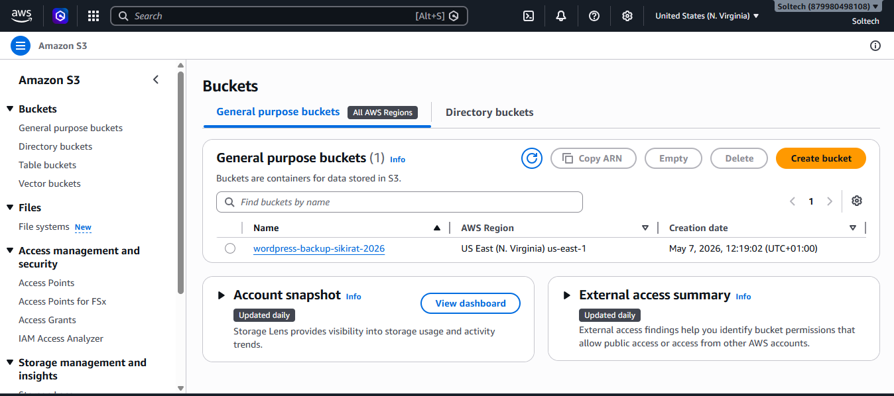

# Architecture Overview

## Application Architecture

The deployment consists of a WordPress application running inside Docker containers on an Amazon EC2 instance. The architecture is designed to separate the application layer from persistent database storage while keeping the setup simple and manageable.

### Architecture Flow

```text
User
  ↓
EC2 Instance (Ubuntu)
  ↓
Docker Engine
  ↓
--------------------------------
|                              |
|  WordPress Container         |
|          ↓                   |
|     MySQL Container          |
|          ↓                   |
--------------------------------
           ↓
EBS Volume (/mnt/mysql-data)
```

The user accesses the WordPress website through the public IP address of the EC2 instance on port 80. Docker runs two containers:

* WordPress container
* MySQL container

Both containers communicate through a custom Docker bridge network. The MySQL container stores its database files on an attached EBS volume mounted at `/mnt/mysql-data`.

---

# Why an EBS Volume is Used for MySQL Data

An EBS volume is used to persist MySQL data outside the container filesystem. Containers are designed to be temporary and disposable. If MySQL stored its data only inside the container, all database data would be lost if:

* the container was deleted
* the container was recreated
* Docker volumes were removed
* the EC2 instance failed without backup

By mounting the EBS volume into the MySQL container, database files remain available even if the MySQL container stops or is recreated.

This design improves durability and makes recovery easier because the EBS volume can be detached and attached to another EC2 instance if needed.

Without the EBS volume:

* WordPress posts
* users
* settings
* uploaded content stored in MySQL

could all be permanently lost.

---

# Security Group Configuration

The following ports were opened in the EC2 security group:

| Port | Purpose                                          |
| ---- | ------------------------------------------------ |
| 22   | SSH access to manage the EC2 instance            |
| 80   | HTTP traffic for accessing the WordPress website |

Port 3306 for MySQL was intentionally not opened publicly because MySQL communication happens internally through the Docker network.

## Security Risks

The current setup still has some risks:

* SSH (port 22) may be exposed to the internet
* WordPress is accessible publicly without HTTPS
* Database credentials are stored in a `.env` file
* Backups rely on AWS credentials configured directly on the server

In a production environment, improvements would include:

* restricting SSH access to trusted IPs
* enabling HTTPS with SSL certificates
* using IAM roles instead of static AWS credentials
* using AWS Secrets Manager or Parameter Store for secrets

---

# Failure Scenario

If the EC2 instance crashed right now:

## Data That Would Survive

* MySQL database files stored on the EBS volume
* Backups uploaded to Amazon S3
* Docker Compose files stored in GitHub or external storage

## Data That Would Be Lost

* Running containers
* Temporary files stored on the EC2 root disk
* Application state not saved to EBS or S3
* Logs stored locally on the instance

The WordPress and MySQL containers could be recreated on another EC2 instance, and the EBS volume could be reattached to recover the database.

---

# Scaling Considerations

If the application needed to support 100x more users, the current architecture would become insufficient because everything runs on a single EC2 instance.

Possible improvements would include:

* Using multiple EC2 instances behind a load balancer
* Moving MySQL to Amazon RDS for managed database scaling
* Using Amazon EFS or S3 for shared file storage
* Running containers with Kubernetes or Amazon ECS
* Adding caching with Redis or CloudFront
* Using Auto Scaling Groups for automatic scaling and recovery

At this stage, I understand the basic scaling concepts, although I would need more experience designing highly available production systems at large scale.

# Images

